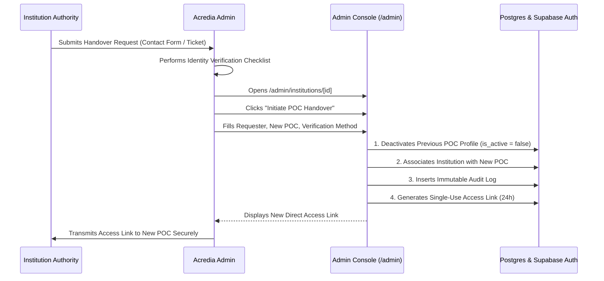

# Point of Contact (POC) Handover & Identity Verification Runbook

This document defines the operational procedure, identity verification standards, and security safeguards for Point of Contact (POC) handover on Acredia.

---

## 1. Overview & Threat Model

In Acredia, each institution is managed by an authorized administrative user (Point of Contact). 

**POC Handover is an account takeover by design.** When an existing POC leaves an institution or changes roles, administrative authority over the institution's verifiable credential issuance and revocation must be transferred to a new individual.

Because an unauthorized handover would permit an adversary to issue counterfeit credentials or revoke legitimate degrees, every handover request must satisfy a **defensible, consistent identity verification standard** before execution.

---

## 2. Identity Verification Standard (Pre-Handover Checklist)

Before actioning a POC handover in the admin console, the operator **must** complete and record at least one primary and one secondary verification method.

### Primary Verification Methods (At Least One Required)
1. **Institutional Domain Email Verification:**
   - The request originates from an email address on the verified official domain of the institution (e.g. `@ox.ac.uk`, `@stanford.edu`).
   - The domain matches the verified institution record.
2. **Official Institutional Letterhead & Authorizing Signature:**
   - Formal letter on official institution stationery signed by the Registrar, Provost, Dean, or Chief Information Officer.
   - Letter explicitly identifies both the outgoing POC and the incoming POC with full names, titles, and institutional email addresses.

### Secondary / Out-of-Band Verification (Required for High-Risk or Ambiguous Requests)
1. **Direct Out-of-Band Phone Confirmation:**
   - Operator places an out-of-band telephone call to the publicly listed registrar or central administrative office of the institution to confirm the authenticity of the signatory and incoming POC.
2. **Existing POC Confirmation:**
   - Where the outgoing POC is departing on amicable terms, a written confirmation email from the outgoing POC's registered email address is obtained.

---

## 3. Step-by-Step Handover Procedure

### Execution Steps:
1. **Navigate to Institution Details:**
   - Open `/admin/institutions/[id]`.
2. **Click "Initiate POC Handover":**
   - In the POC & Access Recovery card, click **Initiate POC Handover**.
3. **Fill Required Handover Details:**
   - **Requester Email:** Email address of the institutional authority requesting the change.
   - **Identity Verification Method:** Detailed description of how the request was confirmed (e.g., `"Official registrar letter signed by Dr. Robert Vance + verified domain email match"`).
   - **New POC Name & Email:** Full legal name and official institutional email address.
   - **Admin Notes / Ticket Reference:** Support ticket number or reference.
4. **Submit & Confirm:**
   - The system atomically:
     * Marks the previous POC user account as **deactivated** in `profiles` (`is_active = false`, timestamp, and reason).
     * Updates the `institutions` record to point to the new POC user.
     * Inserts an immutable record into `admin_audit_logs`.
     * Generates a fresh single-use recovery link valid for 24 hours.
5. **Secure Transmission:**
   - Admin copies the generated single-use access link and transmits it directly to the new POC via their verified institutional email.

---

## 4. Deactivation vs. Deletion Policy

> [!IMPORTANT]
> **Replaced POC accounts are NEVER deleted.**

Under GDPR Art. 17(3)(b) and regulatory compliance standards for verifiable credentials, past credential issuance and revocation actions require an immutable audit trail.
- When a POC is replaced, their profile row in `profiles` and `institution_users` is updated with `is_active = false` and `deactivated_at = NOW()`.
- The user's historical credentials and audit actions remain tied to their immutable user identifier.
- The deactivated user is blocked from logging in or performing any privileged actions.

---

## 5. Audit Trail & Log Schema

Every POC handover and fallback link generation is recorded in `public.admin_audit_logs`:

| Field | Description |
|---|---|
| `id` | Unique UUID of the audit event |
| `action` | Action type (`poc_handover`, `generate_recovery_link`, `generate_invite_link`) |
| `actor_admin_id` | UUID of the admin who authorized and executed the action |
| `target_institution_id` | UUID of the affected institution |
| `requester_email` | Email address of the institutional authority requesting the handover |
| `previous_poc_email` | Email address of the deactivated POC |
| `new_poc_email` | Email address of the newly provisioned POC |
| `details` | JSONB containing verification method, notes, and token generation metadata |
| `created_at` | Timestamp of execution |
